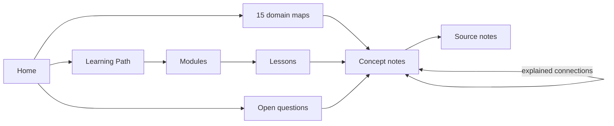

# How to use this vault

This library is built to be learned from, not just stored. Ideas live in **concept notes** that link to each other with a reason for every link, **lessons** teach those concepts in order, and every factual sentence points at the **source** block that supports it. Ten minutes with this page will make the rest faster.

## The shape of the library

- **Home** is the one front door. It groups the fifteen **domain maps** into five families.
- A **domain map** is a curated overview of one field or condition: what the field is about, its concepts grouped by theme, how it connects to other fields, and where its evidence runs out.
- A **concept note** covers one idea completely: definition, how it works, how strong the evidence is, what is still uncertain, recent research, and connections that say *why* each linked idea matters here.
- A **lesson** teaches one concept step by step, with a worked example and practice questions. The **Learning Path** puts the lessons in order.
- A **source note** records one paper or page: what it reports, its scope, and, separately, the library's own appraisal.
- An **open question** sets competing explanations side by side without deciding them.

| Note | Title colour | Graph shape |
| --- | --- | --- |
| Concept | green | circle |
| Lesson | blue | pentagon |
| Source | cyan | square |
| Domain map, hub | purple | hexagon, star |
| Module | purple | octagon |
| Open question | orange | triangle |

## Learning with it

1. Follow [[Learning Path]] from Stage 1; research literacy comes first because every later claim is a group-level finding.
2. **Retrieve before you read.** Write what you already know for two minutes, read the lesson once, close it, then answer its *Check yourself* questions from memory.
3. **Check against the evidence.** Open the concept note and the source block behind any claim you want to keep. The lesson explains, the concept note states, the source block decides.
4. **Space it out.** Return to a lesson days later instead of re-reading it now. [[Study Workflow]] gives the routine and the evidence for it, including its limits.
5. **Revisit by linking.** Opening an older concept and adding a missing connection is review in disguise. The core *Random note* command is a quick way to pick one.
6. Practise reasoning, not just recall, with [[Practice and Synthesis Exercises]].

If you want flashcards, the community *Spaced Repetition* plugin turns `question::answer` lines inside notes into scheduled cards; it is not installed here.

## Reading a concept note

- **Definition** - one or two sentences you should be able to reproduce.
- **How it works** - bold lead-ins, one mechanism each, ending with a **Reading rule**: how to read any claim about this concept.
- **Evidence and status** - how strong the evidence is and what kind of study it comes from.
- **Uncertainties** - what is open.
- **Recent research** - papers from 2023 onward and what each adds, confirms or changes.
- **Connections** - each linked concept with the reason to go there: part of, mechanism behind, measured by, contrasts with, tested in.

Some older concept notes use a shorter layout (*Supported claims*, *Limitation or common misconception*, *Study question*); the rules are the same.

A citation looks like `[[F20 NIMH Autism spectrum disorder#^f20-supports|NIMH, Autism Spectrum Disorder]]`: it points at the exact block that supports the sentence. Hover over it to read the block without leaving the note. A link labelled **Appraisal:** points at the library's own methodological caution, not at a claim made by the source. Block transclusion shows the evidence inline:

![[F20 NIMH Autism spectrum disorder#^f20-supports]]

## Reading a source note

- `access_level` says what was available (abstract only, open full text, public page, official document).
- `verification` says what was checked (`abstract_checked`, `full_text_checked`, `educational_checked`, official checks).
- `reading_status` stays `queued` until the source has actually been read. Downloaded is not read.
- **Reported findings** and **Scope as reported** paraphrase what the source says; **Library appraisal** is this library's reasoning about design and limits, kept apart on purpose.
- The tag `research/recent` marks papers from 2023 onward that were added to bring concepts up to date.

## Finding your way

- **Breadcrumbs** at the top of a note show where it sits: Home, domain map, concept.
- **Hover** over any link to preview it; **backlinks** show every note that points here.
- **Quick switcher** (Cmd+O) and **Omnisearch** find a note by name or content.
- **Tables and cards:** [[Library.base]] (sources), [[Reference Index.base]] (concepts), [[Knowledge Explorer.base]] (bridges, evidence reach, evidence age).
- **Look-up pages:** [[Reference Index]] (A-Z, by kind, by condition, relationship register) and [[Glossary]].

## The graph

The global graph opens on the **concept map**: Home, the fifteen domain maps and the concept notes, coloured by family. Sources, lessons and index pages are filtered out because they link to everything and bury the structure.

Colour means family: **blue** biology and chemistry · **green** mind and computation · **orange** clinical and applied · **red** the four conditions · **yellow** research methods · **white** Home and domain maps. In views that show them: **grey** sources, **gold** recent research, **teal** lessons and modules, **magenta** open questions.

Other views are saved under **Bookmarks → Graph views**:

| View | Answers |
| --- | --- |
| Concept map | How is the library organised, and which fields lean on each other? |
| Concepts only | How do the ideas themselves connect, without the maps? |
| Concepts and evidence | Which concepts rest on which sources? |
| Recent research | Where has recent work been linked in? |
| Conditions / Foundations / Clinical and applied | A close-up of one family's concepts and how they interlink. |
| Learning route | What does the course teach, and which concepts does each lesson serve? |
| Open questions | Which concepts does each question draw on? |
| Evidence quality · Concept kinds | How each source was checked; what sort of knowledge each concept is. |
| Everything | The unfiltered graph, for maintenance. |

For everyday navigation use the **local graph** of the note you are reading (depth 1 or 2) rather than the global one. An edge means "this note links to that one", never "this causes that".

## Adding to the library

**A paper.** Create it from [[Source template]] in the `Articles/` folder of its domain. Take identifiers (DOI, PMID, journal, year) from the publisher or PubMed page, never from memory. Write two or three findings in your own words, each with a block anchor (`^p12345678-slug`), under 100 words in total; put your own caution under *Library appraisal*. Keep `reading_status: queued`. Tag it `research/recent` if it was published in 2023 or later. Then cite its anchors from the concept note and update that note's `source_count`.

**A concept.** File it in its domain folder (in the subfolder for its theme), set `up` to the domain map, and add it to the map's *Concept register*. Write the sections above, give every connection a reason, and link it from two or three related concepts.

**A question.** Use [[Argument template]]; keep competing explanations and the evidence each would need, and never move a hypothesis into a concept note without a source.

**A web page.** The Web Clipper template in `Support/Web Clipper/` captures a page into a source record; replace the captured text with your own summary before keeping it. Downloaded files go in `Support/` with their provenance in [[Attachments]]; a PDF page link (`#page=6`) is added only after the page has been checked.

Before keeping a batch of changes, check four things: every claim links to a block that says what the claim says; findings and appraisal are separate; identifiers and reading status are exact; no summary restates an abstract.

## Why it is organised this way

The layout follows common expert advice for personal knowledge libraries, adapted to an evidence library.

- **One front door, one layer of maps.** A Home note leads to curated maps of content, and a note can sit on several maps without moving. Extra hub layers pay off only in much larger collections. ([Linking Your Thinking: MOCs](https://notes.linkingyourthinking.com/Cards/MOCs+Overview) · [zettelkasten.de: three layers of structure](https://zettelkasten.de/posts/three-layers-structure-zettelkasten/))
- **Concept-oriented, atomic, densely linked notes.** One note per idea, complete but not sprawling, so later reading accumulates in one place. ([Andy Matuschak: evergreen notes should be concept-oriented](https://notes.andymatuschak.org/Evergreen_notes_should_be_concept-oriented) · [should be atomic](https://notes.andymatuschak.org/Evergreen_notes_should_be_atomic))
- **Links carry their reason.** A bare link says little; a link placed like a citation, with the relationship stated, can be followed with purpose. ([zettelkasten.de: link context](https://zettelkasten.de/posts/what-and-where-is-a-link-context-explained-using-citation-conventions/))
- **Sources apart from ideas.** Literature notes hold what a source says; concept notes hold what you understand, citing the sources. ([zettelkasten.de on Sönke Ahrens](https://zettelkasten.de/posts/concepts-sohnke-ahrens-explained/))
- **Properties over folders.** Views select notes by `note_type`, tags and properties, so a note can move without breaking anything. ([Obsidian help: Properties](https://obsidian.md/help/properties) · [Bases](https://obsidian.md/help/bases) · [Steph Ango: how I use Obsidian](https://stephango.com/vault))
- **A graph you can read.** Filter first, then colour the largest groups, bookmark each configured view, and navigate with the local graph. ([Obsidian help: Graph view](https://obsidian.md/help/plugins/graph) · [Bookmarks](https://obsidian.md/help/plugins/bookmarks))
- **Study by retrieval and spacing.** Practice testing and distributed practice outperform re-reading and highlighting. ([Dunlosky et al. 2013](https://www.psychologicalscience.org/publications/journals/pspi/learning-techniques.html) · [[P37615780 Trumble 2024 Distributed and retrieval practice review|Trumble 2024]] · [Andy Matuschak: writing good prompts](https://andymatuschak.org/prompts/))

> [!warning] Educational library, not clinical advice
> Nothing here is a diagnosis, a dose, a titration or an individual treatment decision.
